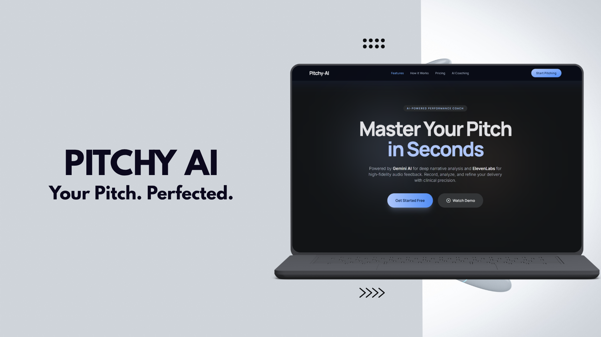

# [Pitchy AI](https://devpost.com/software/pitchy-ai)
> ### Making your pitch, less pitchy.

  
  
  
  
  
  

> Pitchy-AI is a web-based application that enables users to submit pitches — either as live audio recordings or typed text — and receive AI-driven analysis, performance metrics, and an optional improved rewrite. The platform integrates Google Gemini for language understanding and pitch evaluation, and ElevenLabs for high-quality AI voice synthesis, allowing users to hear their pitch back in both its original and improved forms.

---

## Features

*  **Voice Recording** — Record your pitch directly in the browser using your microphone

*  **Audio Upload** — Sends recorded audio to a backend server

*  **AI Processing** - Using ElevenLabs, Gemini, Gemma4

* **Analysis Dashboard** — Displays transcript and feedback

*  **Seamless Flow** — Recording → Processing → Results page

